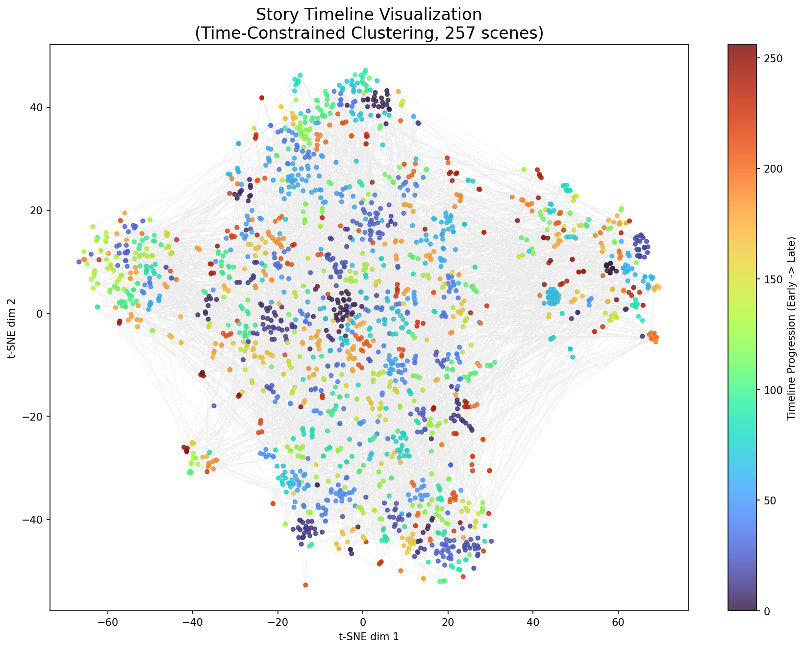

# Hasu RAG: 链接！ 喜欢！ 爱生活！ 剧情智能分层问答系统

这是一个基于 **LangChain v1.x**、**Qdrant** 和 **Xinference** 构建的高级 RAG（检索增强生成）系统。
本项目专门针对长篇剧情/剧本数据进行了深度优化，实现了**混合检索 (Hybrid Search)**、**带约束的时间序聚类 (Time-Constrained Clustering)** 和 **双路上下文融合 (Dual-Path Context Fusion)**，能够同时应对“微观细节追问”、“宏观剧情概括”以及“深度剧情分析”三类用户查询。

---

## 系统架构与实现思路

本系统并不是简单的 RAG 套壳，而是针对剧情类数据的特性设计了独特的分层路由与索引架构。

### 1. 双层知识库设计 (Dual-Layer Knowledge Base)

为了兼顾细节与宏观，我们构建了两个独立的 Qdrant 集合：

| 集合名称 | 数据层级 | 存储内容 | 检索模式 | 典型用途 |
| :--- | :--- | :--- | :--- | :--- |
| **`story_knowledge_base`** | **微观层 (Raw Fragments)** | 原始剧情切片，包含完整的台词、场景、时间元数据。 | **Hybrid (Dense + Sparse)** | “梢在哪一话哭了？“<br>“花帆最喜欢的食物是什么？” |
| **`story_summary_store`** | **宏观层 (Cluster Summaries)** | 经过聚类生成的剧情摘要，涵盖不同时间跨度的事件概括。 | **Dense Only** | “第10话讲了什么故事？”<br>“吟子对花帆的感情变化是怎样的？” |

### 2. 核心工作流

#### A. 数据入库 (Ingestion)
* **脚本**: `app/ingest.py` (全量) / `app/ingest_append.py` (增量)
* **逻辑**:
    1.  读取剧情数据，支持增量追加（基于 UUID5 去重）。
    2.  利用 **Xinference (bge-m3)** 生成稠密向量 (Dense Embeddings)。
    3.  利用 **FastEmbed (BM25)** 生成稀疏向量 (Sparse Embeddings) 用于关键词精确匹配。
    4.  存入 `story_knowledge_base`。

#### B. 分层索引构建 (Hierarchy Building)
* **脚本**: `app/build_hierarchy.py`
* **算法思路 (Time-Constrained Agglomerative Clustering)**:
    1.  **加载与排序**: 加载所有碎片并严格按剧情时间线排序。
    2.  **连接性约束聚类**: 使用 `AgglomerativeClustering` 配合 `kneighbors_graph`，强制只聚合在时间上相邻的剧情块，**杜绝跨时间线的错误归纳**。
    3.  **LLM 摘要生成与智能增量更新**: 调用 LLM 生成剧情摘要。脚本具备**智能变更检测**功能，通过对比新旧聚类的“成员指纹”，自动识别因新数据加入导致的聚类边界变化。仅对真正内容变动的簇重新生成摘要，完美解决增量数据带来的“蝴蝶效应”，既保证准确性又最大化节省 Token。
    4.  **存入**: 将摘要存入 `story_summary_store`，并标记层级。

#### C. 智能问答管道 (Query Pipeline)
* **脚本**: `app/query.py`
* **流程**:
    1.  **深度意图识别 (Intent Classification)**: 基于 LLM 的三元分类：
        * `fact`: 事实追问（时间、地点、物品）。
        * `overview`: 纯宏观概括。
        * `analysis`: **深度分析**（如角色关系、情感动机、性格评价）。
    2.  **动态路由与融合 (Routing & Fusion)**:
        * **Fact 模式**: 单路检索原始库。利用 **Query Rewrite** 自动扩展同义词（如“哭” -> “泣く, 涙, 号泣”），并大幅提升 Top-K 窗口以优化计数类问题召回率。
        * **Overview 模式**: 单路检索摘要库。
        * **Analysis 模式 (Dual-Path)**: **同时**检索摘要库（获取背景与氛围）和原始库（获取具体台词证据），通过 `Context Fusion` 模板将宏观与微观信息拼接，生成有理有据的深度回答。

---

## 项目结构说明

```text
.
├── app/
│   ├── build_hierarchy.py     # 分层索引构建主脚本 (支持断点续传/覆盖)
│   ├── ingest.py              # 全量数据入库脚本 (会清空旧数据)
│   ├── ingest_append.py       # 增量数据入库脚本 (幂等追加)
│   ├── query.py               # [入口] 核心智能问答启动脚本
│   ├── reranker.py            # 自定义 Rerank 组件封装
│   ├── visualize_clusters.py  # 生成静态时间线聚类图 (PNG)
│   └── visualize_interactive.py # 生成交互式剧情地图 (HTML)
├── data/
│   ├── stories.json           # 原始数据源
│   └── new_stories.json       # 增量数据源示例
├── qdrant_storage/            # Qdrant 本地数据持久化目录
└── requirements.txt           # Python 依赖
```

### 可视化分析

项目包含用于验证聚类效果的可视化脚本，用于验证算法是否正确捕捉了剧情的时间流动：
    1. 静态时间线 (visualize_clusters.py): 生成彩虹色谱的轨迹图，验证聚类的时间连续性。
    2. 交互式地图 (visualize_interactive.py): 生成 HTML 文件，支持鼠标悬停查看具体的场景ID、出场角色和剧情预览，用于深度调试数据质量。

下图展示了剧情在时间线上的聚类分布 (`app/build_hierarchy.py` 的产出效验)：



---

## 快速开始

### 1. 环境准备
如果你使用 Docker 或 Conda 创建环境，请明确指定 Python 3.11，并配置好以下服务：

*   **Qdrant**: 向量数据库 (默认 `localhost:6333`)
*   **Xinference**: 模型推理服务 (提供 embedding, rerank, llm)

不支持: Python 3.8 及以下，Python 3.12+ (部分库可能尚未提供预编译的 Wheel 包)

安装 Python 依赖：

```bash
pip install -r app/requirements.txt
```

### 2. 配置环境变量

你可以通过环境变量覆盖默认配置（通常在 `.env` 或直接 export）：

```bash
export QDRANT_URL="http://localhost:6333"
export XINFERENCE_SERVER_URL="http://your-server:9997"
# LLM 配置 (OpenAI 协议兼容)
export LLM_BASE_URL="http://your-server:9001/v1"
export LLM_API_KEY=""
export LLM_MODEL_NAME=""
```

### 3. 数据流程

**Step 1. 初始化原始知识库**

```bash
python app/ingest.py
```

**Step 2. 构建分层摘要索引** (此步耗时较长，视数据量而定，支持中断后继续运行)

```bash
python app/build_hierarchy.py
```

**Step 3. (可选) 生成可视化报表**

```bash
python app/visualize_interactive.py
# 结果将保存为 interactive_timeline.html
```

**Step 4. 启动问答系统**

```bash
python app/query.py
```

---

## 关键技术栈

*   **LangChain**: 编排 RAG 流程与 Prompt 管理。
*   **Qdrant**: 混合检索 (Dense + Sparse) 核心存储。
*   **Xinference**: 本地化高性能模型推理 (兼容 OpenAI 协议)。
*   **FastEmbed**: 提供轻量级的 Sparse Vector 生成 (BM25)。